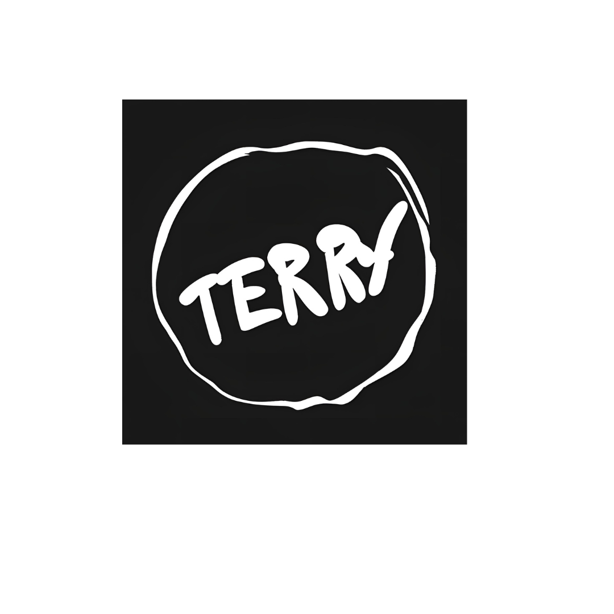

<h1> Hi, I'm 이성훈(Terry) </h1>
<h3> Dream CTO
<h3> Team Leader 👋 = Tech Lead + Engineering Manager 
<h4> Email : balee14@naver.com
<h4> Location : 영등포구 문래동
<h4> Blog : https://balee14.github.io/

---

<h2> My tech stack 📚 </h2>

<h3>Strong

<h3>Knowledgeable

<h3>Collaboration tool

